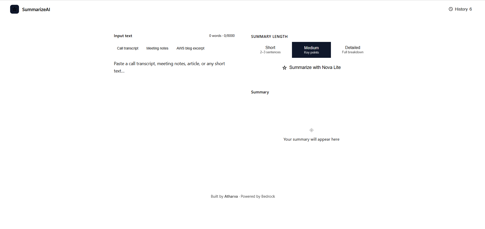
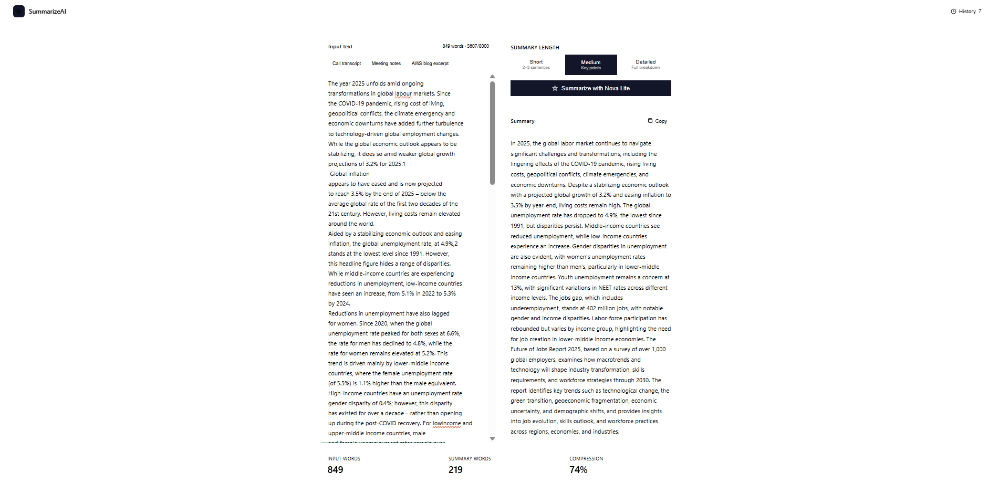
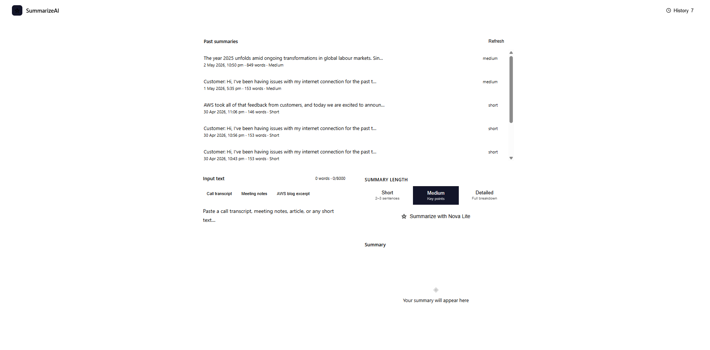

# SummarizeAI – Serverless Text Summarization System

## 🚀 Overview
SummarizeAI is a full-stack serverless application that generates concise summaries from user-provided text using Amazon Bedrock (Nova Lite).

The system demonstrates an end-to-end AI workflow on AWS, covering frontend delivery, API integration, model invocation, and persistent storage, while maintaining scalability and minimal infrastructure overhead.

---

## 🧱 Architecture

User → CloudFront → S3 (React App) → API Gateway → Lambda → Bedrock → DynamoDB

### Architecture Diagram

---

## 🔄 How It Works

1. User enters text in the frontend (React app served via CloudFront).  
2. The request is sent to Amazon API Gateway.  
3. API Gateway triggers an AWS Lambda function (summarizer).  
4. Lambda invokes Amazon Bedrock (Nova Lite) to generate a summary.  
5. The result is stored in DynamoDB along with metadata (timestamp, length).  
6. The summarized response is returned to the frontend.  
7. A separate Lambda function retrieves history from DynamoDB for display.  

---

## ⚙️ Tech Stack

- **Frontend:** React  
- **CDN:** Amazon CloudFront  
- **Storage (Frontend):** Amazon S3  
- **API Layer:** Amazon API Gateway  
- **Compute:** AWS Lambda  
- **AI Model:** Amazon Bedrock (Nova Lite)  
- **Database:** Amazon DynamoDB  

---

## ✨ Features

- Real-time text summarization  
- Adjustable summary length (short / medium / long)  
- Persistent history using DynamoDB  
- Serverless architecture (no infrastructure management)  
- Secure frontend delivery via CloudFront + OAC  
- Cost control using backend service toggle  

---

## 📸 Screenshots

### Main Interface

### Summary Output

### History Panel

---

## 🔐 Design Decisions

- Used **Lambda proxy integration** to simplify API handling and reduce configuration overhead  
- Implemented **least-privilege IAM roles** by separating summarizer and history Lambda permissions  
- Leveraged **CloudFront with Origin Access Control (OAC)** to secure S3 while enabling global delivery  
- Applied **frontend + backend validation** to ensure reliability and prevent invalid inputs  
- Designed for **short-text summarization** to avoid complexity of chunking in the initial version  

---

## 🧠 Learnings

- Handling API Gateway and Lambda proxy event structure  
- Managing JSON parsing between frontend and backend  
- Debugging CloudFront caching and invalidation issues  
- Configuring IAM roles for Bedrock model invocation  
- Designing clean API responses for frontend compatibility  

---

## 👤 Author

Built by Atharva